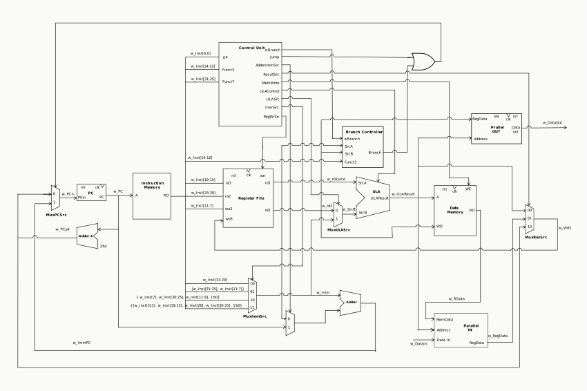

# Verilog Project: Development of an 8-Bit RISC-V Processor

## R-Type Instructions:
- **add:** `rd = rs1 + rs2` *(Example: If rs1 = 5 and rs2 = 7, then rd = 12).*
- **sub:** `rd = rs1 - rs2` *(Example: If rs1 = 10 and rs2 = 3, then rd = 7).*
- **and:** `rd = rs1 AND rs2` *(Example: If rs1 = 1101 and rs2 = 1010, then rd = 1000).*
- **or:** `rd = rs1 OR rs2` *(Example: If rs1 = 1101 and rs2 = 1010, then rd = 1111).*
- **xor:** `rd = rs1 XOR rs2` *(Example: If rs1 = 1101 and rs2 = 1010, then rd = 0111).*

## I-Type Instructions:
- **xori:** `rd = rs1 XOR imm` *(Example: If rs1 = 1101 and imm = 1010, then rd = 0111).*
- **ori:** `rd = rs1 OR imm` *(Example: If rs1 = 1010 and imm = 0011, then rd = 1011).*
- **slti:** `rd = (rs1 < imm) ? 1 : 0` *(Example: If rs1 = 5 and imm = 8, then rd = 1).*
- **addi:** `rd = rs1 + imm` *(Example: If rs1 = 7 and imm = 3, then rd = 10).*

## Load/Store Instructions:
- **lb:** `rd = Mem[rs1 + imm]` *(Example: If rs1 = 1000 and imm = 0011, then rd receives the value stored at memory position 1000 + 3).*
- **sb:** `Mem[rs1 + imm] = rs2` *(Example: If rs1 = 1010, imm = 0100, and rs2 = 1101, then the value 1101 is stored at memory position 1010 + 4).*

## Branch Instructions:
- **beq:** `if (rs1 == rs2) pc = pc + imm` *(Example: If rs1 = 6, rs2 = 6, and imm = 2, then there will be a conditional jump).*
- **bne:** `if (rs1 != rs2) pc = pc + imm` *(Example: If rs1 = 5, rs2 = 3, and imm = 3, then there will be a conditional jump).*
- **blt:** `if (rs1 < rs2) pc = pc + imm` *(Example: If rs1 = 3, rs2 = 5, and imm = 2, then there will be a conditional jump).*
- **bge:** `if (rs1 >= rs2) pc = pc + imm` *(Example: If rs1 = 8, rs2 = 6, and imm = 3, then there will be a conditional jump).*

## Jump Instructions:
- **jal:** `rd = pc + 4; pc = pc + imm` *(Example: If imm = 8, then rd will receive the value of the next instruction address, and there will be an unconditional jump).*
- **jalr:** `rd = pc + 4; pc = rs1 + imm` *(Example: If rs1 = 12 and imm = 2, then rd will receive the value of the next instruction address, and there will be an unconditional jump to the address 12 + 2).*

## Shift Instructions:
- **sll:** `rd = rs1 << rs2` *(Example: If rs1 = 6 and rs2 = 2, then rd = 24).*
- **srl:** `rd = rs1 >> rs2` *(Example: If rs1 = 16 and rs2 = 3, then rd = 2).*
- **slli:** `rd = rs1 << imm` *(Example: If rs1 = 5 and imm = 2, then rd = 20).*
- **srli:** `rd = rs1 >> imm` *(Example: If rs1 = 32 and imm = 3, then rd = 4).*
